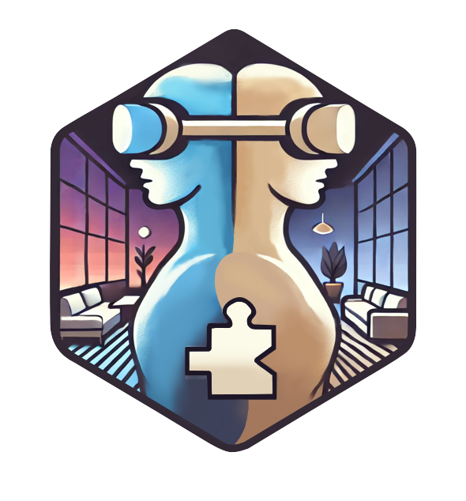
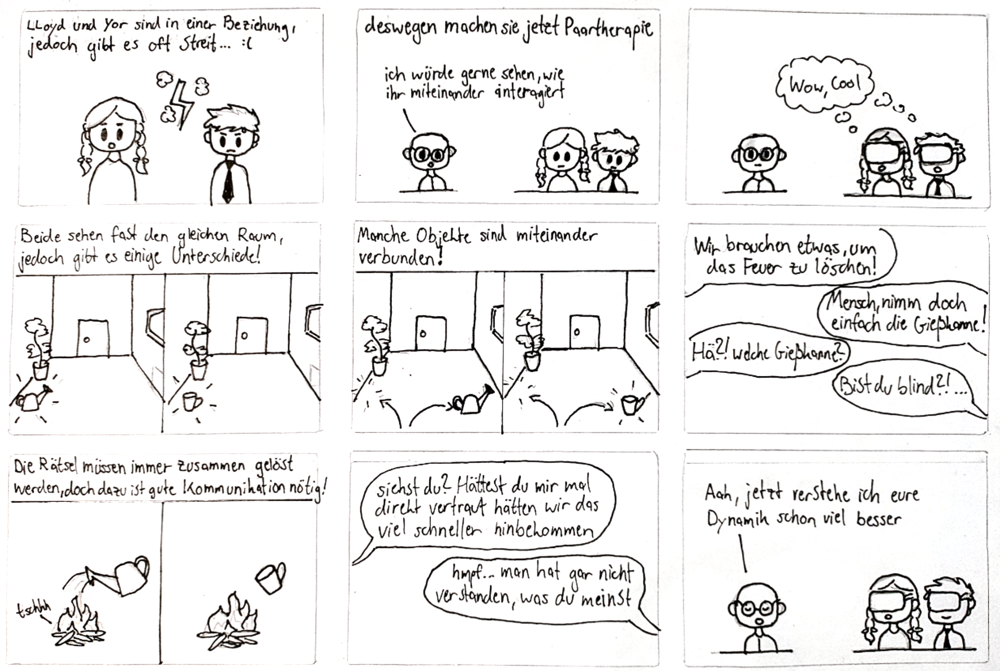

# Parallel Perspectives

## Anleitung
Die Anwendung wurde mit der Unity Version 6000.0.28f1 entwickelt. Alle Assets wurden in Blender erstellt. Das Projekt kann geklont werden und dann im Unity Hub mit _Add_ -> _Add Projekt From Disk_ geöffnet werden. Wenn das Spiel im Unity Editor gestartet wird, gibt es die Möglichkeit sich mit simulierten VR Controls fortzubewegen und die Anwendung auszutesten. Um die Anwendung in VR zu testen, muss das Projekt für Android gebuildet werden und die entstandende APK dann auf dem Headset installiert werden. 
Wir haben für das einfachere Testen die Extension [ParrelSync](https://github.com/VeriorPies/ParrelSync) genutzt, die es einem erlaubt, zwei Unity Editors des gleichen Projekts parallel laufen zu lassen und diese automatisch miteinander synchronisiert. Ein Klon kann im Unity Editor erstellt werden unter dem Reiter "ParrelSync" -> Clones Manager. Falls nur mit dem Clone das Networking nicht funktionieren sollte, muss eventuell unter Edit -> Project Settings -> Player -> Other Settings -> \*runterscrollen\* -> Scripting Define Symbols das Symbol **HAS_PARRELSYNC** hinzugefügt werden. 

## AMITUDE
Eine VR-Anwendung für **(A:)** Paartherapie **(T:)** in der Paare durch Kommunikation und Zusammenarbeit Rätsel lösen **(E:)** in einem gemeinsamen virtuellen (und physischen) Raum, der je nach Betrachter kleine, individuelle Unterschiede aufweist, **(I:) (U:)** indem beide Partner **(M:)** visuell ihre jeweilige Umgebung durch ein VR-Headset wahrnehmen, **(M:) ** kommunizieren und **(M:)** motorisch mit virtuellen Objekten über Hand-Controller oder handtracking-fähige Geräte interagieren.)

## CROW
**Character:**
 - Paare mit Wunsch nach Verständnis und Zusammenarbeit
 - Kommunikationsschwierigkeiten
 - Fehlende Klarheit
 - Emotionaler Einfluss
 - Unterbrechungen
 - Ungleiche Gesprächsanteile
 - Vorannahmen

**Relationship:**
- Partner miteinander
- Partner mit Therapeut

Nutzer mit VR
- alles neu und verwirrend
- unerfahren in der Steuerung

**Objective:**
- Simulation einer gemeinsamen Problemlösung
- Erlernen konstruktiver Kommunikation
- Auflockerung

**Where:**
- gemeinsamer physischer/virtueller Raum 
- in einer therapeutischen Praxis
- idealer Weise in einem großen Raum

## Storyboard

## Architektur
Die Anwendung nutzt die Unity Game Engine und ihre Universal Render Pipeline. Für das Networking wurde das Unity-eigene **Unity Netcode for GameObjects** verwendet. Wir nutzen außerdem die Unity Services Unity Lobby sowie Unity Relay um einfaches Joinen der Spieler zu ermöglichen. Für die Integration von VR und das Übersetzen der Spielerinputs in das Spiel wurde das [XR Interaction Toolkit](https://docs.unity3d.com/Packages/com.unity.xr.interaction.toolkit@3.0/manual/index.html) genutzt. Alle 3D Objekte wurden von uns selbst in Blender erstellt und dann in Unity importiert. Um die Anwedung außerdem nicht jedes Mal auf das Headset bringen zu müssen um sie zu testen, haben wir die Extension [ParrelSync](https://github.com/VeriorPies/ParrelSync) verwendet. 

 
